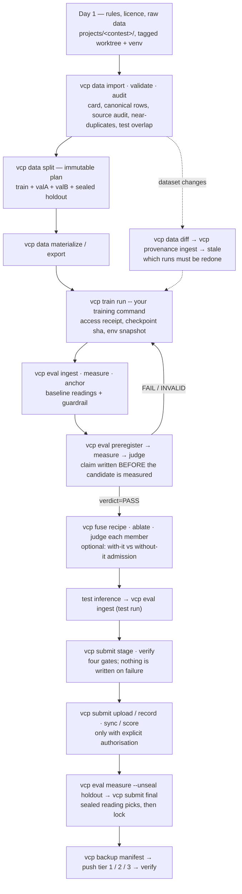
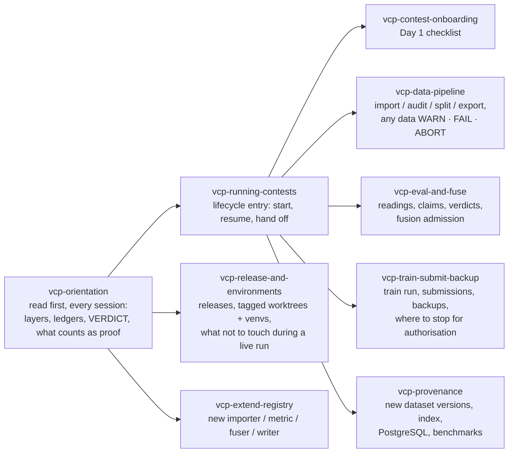

# vcp — vision contest pipeline

[](https://github.com/eric20041027/Vision-contest-pipeline/actions/workflows/ci.yml)
[](LICENSE)
[](https://www.python.org/downloads/)

**A command-line pipeline for image competitions where every number you report stays traceable to the exact data, code and weights that produced it.**

Most competition tooling helps you train faster. vcp helps you avoid the other failure: a model that looks better on your screen, gets picked, and then collapses on the private leaderboard. It does that by making the evidence chain mechanical rather than remembered — split plans you cannot quietly edit, claims written down before the candidate is measured, readings that refuse to be produced when a guardrail moved, and a backup manifest generated backwards from the conclusion you need to defend.

繁體中文版：[README.zh-TW.md](README.zh-TW.md)

## The failure it was built for

It comes out of a post-mortem on a marine-debris detection contest where a submission that led the public board fell apart on the private one. Three causes, each now a mechanism instead of a habit:

| What went wrong | What vcp does about it |
|---|---|
| The model was only ever validated on one slice of data | A split plan needs at least two mutually exclusive eval subsets plus a sealed holdout; a judgement needs the candidate to win on at least two of them |
| Ensemble members were admitted by feel, not by evidence | Admission is "with it versus without it": each member gets its own pre-registered claim and its own verdict |
| Run-to-run noise was estimated after the fact, to taste | σ_p is a pre-registered input, and a tuning claim without one is refused |

## Install

Requires Python 3.12 and [uv](https://docs.astral.sh/uv/).

```bash
git clone https://github.com/eric20041027/Vision-contest-pipeline
cd Vision-contest-pipeline
uv sync                       # core
uv sync --extra dicom         # DICOM importers and decoders
uv sync --extra postgres      # optional PostgreSQL provenance backend
uv run vcp --help
```

Or install the CLI straight from git:

```bash
pip install git+https://github.com/eric20041027/Vision-contest-pipeline
```

## Quickstart

One command, about a minute, no downloads. It builds a synthetic 240-image dataset in a temporary directory, then walks the whole loop from raw files to a judged claim:

```bash
uv run python examples/quickstart.py
```

It runs these twelve steps and prints the `VERDICT` line each one ends with:

1. make a tiny image-folder dataset
2. **import** — raw files become a dataset card, a canonical `samples.jsonl`, and a per-row source audit
3. **validate** — re-verify the card, the rows and their hashes
4. **split** — one immutable plan with two independent eval subsets
5. generate two fake models' predictions, one right ~70% of the time and one ~93%
6. **ingest** — framework output becomes the canonical prediction file (hashed, recorded)
7. **measure** the baseline — guardrails first, then one reading per subset and metric
8. **anchor** — freeze that reading as the guardrail every later run is checked against
9. **preregister** — the claim is written down *before* the candidate is measured
10. **measure** the candidate
11. **judge** — paired bootstrap on every base; admission needs t ≥ 2.0 on at least two of them
12. **report** — the ledger

The last verdict looks like this:

```text
valA  baseline=0.683 candidate=0.883 delta=0.200 t=2.98
valB  baseline=0.683 candidate=0.933 delta=0.250 t=4.01
VERDICT cmd=eval.judge status=OK dataset=demo prereg=p1 verdict=PASS bases_positive=2
```

Now open `examples/quickstart.py`, drop `CANDIDATE_ACCURACY` to about `0.80`, and run it again. The gap still looks convincing, but the verdict flips to `FAIL` because one of the two bases misses the threshold. That is the entire point of the tool.

## The layers

Each layer is a command group. You can adopt one without adopting the rest.

| Group | What it owns | Key commands |
|---|---|---|
| `vcp data` | Dataset cards, canonical rows, split plans, entry audit, decode cache | `import`, `validate`, `split`, `audit`, `export`, `materialize`, `diff` |
| `vcp eval` | Readings, guardrails, σ_p, pre-registration, verdicts | `ingest`, `measure`, `anchor`, `sigma`, `preregister`, `judge`, `status`, `report` |
| `vcp fuse` | Ensemble recipes and member admission | `recipe`, `build`, `ablate` |
| `vcp train` | Wraps any training command and records what it actually read and produced | `run`, `upload`, `status` |
| `vcp submit` | Quota, deadline, candidate identity, final selection, lock | `init`, `stage`, `upload`, `record`, `sync`, `final`, `verify`, `status` |
| `vcp backup` | Evidence manifests generated backwards from a conclusion, tiered push and verify | `manifest`, `push`, `verify`, `pull`, `status` |
| `vcp artifact` | The immutable-artifact primitive the layers above are built on | `create`, `show`, `verify`, `lineage`, `status`, `clean` |
| `vcp provenance` | Dataset evolution and downstream impact index | `rebuild`, `sync`, `ingest`, `impact`, `stale`, `explain`, `verify-index` |

Full option tables and worked flows: [docs/reference/cli.md](docs/reference/cli.md). If you prefer pictures first, read [the visual guide](docs/guides/VCP_VISUAL_GUIDE.md).

## Running a contest with vcp

The whole contest is one chain of gated steps. Each arrow is a command whose `VERDICT` you read before moving on; the dashed branch is what happens when the organiser ships a new version of the data.



Gates that cannot be reordered: `audit` before a split that uses its groups; baseline `measure`/`anchor` before any candidate; `preregister` before the candidate's first `measure`; `verdict=PASS` before `stage --kind candidate`; `stage`/`verify` before any upload; at least one real upload before the sealed final window; a real conclusion before its backup manifest. The sealed holdout is opened once, with `--unseal --reason`, and the reason is recorded.

## Working with an agent: the skills and when they fire

The repository ships nine skills (`.claude/skills/` for Claude Code, mirrored to `.agents/skills/` for Codex). They are how an agent learns the rules above instead of guessing them. Load `vcp-orientation` first in any session; then the lifecycle entry routes to a specialist skill for the step you are on.



| When | Skill | What it stops you from doing wrong |
|---|---|---|
| Any new session, or someone asks "what is this?" | `vcp-orientation` | Treating a RUNBOOK line as evidence; reading `judge status=OK` as admission; editing a ledger |
| Starting, resuming or handing off a contest | `vcp-running-contests` | Reordering the gates; reporting a pending command as done |
| First day of a new contest | `vcp-contest-onboarding` | Wrong `--downloaded-at`; test set left outside the framework; running from the development checkout |
| Importing, auditing, splitting, exporting | `vcp-data-pipeline` | Tuning options to silence a WARN; splitting without audit groups; faking labels for a test set |
| Predictions → readings → claims → verdicts; ensembles | `vcp-eval-and-fuse` | Post-hoc pre-registration (including re-ingesting measured weights under a new run id); measuring on a contaminated base; opening the holdout casually |
| Wrapping training, staging and uploading, backing up | `vcp-train-submit-backup` | Staging a FAILed candidate; uploading without authorisation; mistaking a local copy for an off-machine backup |
| The organiser changes the data | `vcp-provenance` | Overwriting the old version; hand-editing the index; using `auto` where the policy is known to pick wrong |
| Releasing, setting up venvs, working while a run is live | `vcp-release-and-environments` | Bumping the version for a `projects/` change; pulling `main` into a checkout a training run is using |
| Adding a format, metric or fuser | `vcp-extend-registry` | Putting a contest name into `src/vcp`; registering without updating the CLI help and reference |

For a person, the same order applies: the [visual guide](docs/guides/VCP_VISUAL_GUIDE.md) is the orientation, [docs/reference/cli.md](docs/reference/cli.md) is the specialist, and the contest's `projects/<contest>/RUNBOOK.md` is the ledger of what was actually done. To delegate a whole contest, use the prompt template in `.claude/skills/vcp-running-contests/operator-guide.md`.

## Design rules worth knowing before you start

- **Every command ends with a `VERDICT` line.** `status=OK|WARN|FAIL|ABORT`, exit code `0/0/1/2`, machine-readable `key=value` fields. With `--json` the result goes to stdout and the VERDICT to stderr. Commands never prompt.
- **Written-once files stay written once.** Split plans, pre-registrations, fusion recipes and backup manifests are immutable. To change one, you change its id — so the old evidence keeps meaning what it meant.
- **Ledgers only grow.** Readings, judgements, σ_p and submissions are append-only. Run cards are rewritten but the previous hash goes to `history.jsonl` first.
- **Guardrails run before readings.** If an anchored reading no longer reproduces, `measure` aborts and writes nothing rather than recording a number under changed conditions.
- **Reads are proven, not declared.** A training loop that reads through vcp's accessor leaves an access receipt naming exactly which subsets it touched, so "this model never saw the holdout" becomes checkable instead of promised.
- **vcp never touches your credentials.** No token options, no credential fields, no reading of rclone or Kaggle config. Third-party CLI output is redacted before it lands anywhere.
- **Competition-specific code stays out of the core.** `src/vcp` never contains a contest name; your metrics, converters and formats register themselves through `--plugin`.

## Documentation

| Where | What |
|---|---|
| [docs/guides/VCP_VISUAL_GUIDE.md](docs/guides/VCP_VISUAL_GUIDE.md) | Six diagrams: the layers, the lifecycle, where evidence lives, reading a VERDICT, who decides what |
| [.claude/skills/](.claude/skills/) | The nine agent skills above (mirrored in `.agents/skills/` for Codex); `vcp-orientation` is also the fastest human-readable summary of the rules |
| [docs/benchmarks/postgres-provenance-report-v1.md](docs/benchmarks/postgres-provenance-report-v1.md) | The PostgreSQL adaptive-provenance evidence in ten items (versions, integration, six-method, held-out gate, real data, latency, storage, EXPLAIN, parity) |
| [docs/reference/cli.md](docs/reference/cli.md) | Every command, option and worked flow |
| [docs/guides/](docs/guides/) | Dataset evolution provenance, PostgreSQL backend |
| [docs/superpowers/specs/](docs/superpowers/specs/) | Design documents, one per layer |
| [docs/postmortems/](docs/postmortems/) | The contest write-up this project came from |
| [CONTRIBUTING.md](CONTRIBUTING.md) | Development setup, the rules the test suite enforces, how to send a change |

Most documents under `docs/` are in Traditional Chinese; the code, CLI help and this README are in English.

## Project status

`0.8.1`, pre-1.0: the artifact and ledger formats are stable enough to build on, but the CLI contract can still change on a minor version. See [CHANGELOG.md](CHANGELOG.md) for what each bump means.

Honest boundaries: the pipeline has been run end to end on a local RSNA knee subset (data, training, judgement, staging, backup) and is being used for that competition now. The optional PostgreSQL provenance backend has five live evidence sets — integration 51/51, a 1,224-measurement calibration, a 3,672-measurement six-method benchmark at 1K–100K entities, a held-out evaluation whose aggregate gate passes (1.018 / 1.017), and a real-data track — with exact parity against canonical replay throughout. Two findings are reported as limitations, not hidden: incremental maintenance beats a full rebuild at every change ratio measured (there is no crossover), and the v1 adaptive policy picks FULL wrongly on small graphs and near-total changes. The 1M-entity scale is out of the normative matrix by a recorded ruling. See [docs/benchmarks/postgres-provenance-report-v1.md](docs/benchmarks/postgres-provenance-report-v1.md).

## Contributing

Issues and pull requests are welcome — see [CONTRIBUTING.md](CONTRIBUTING.md) for the development setup and the conventions the review gates enforce. By participating you agree to the [Code of Conduct](CODE_OF_CONDUCT.md). Security reports: [SECURITY.md](SECURITY.md).

## License

MIT — see [LICENSE](LICENSE).
