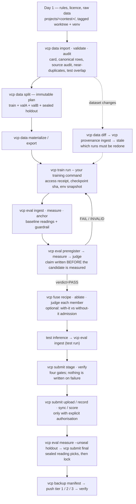

# vcp — vision contest pipeline

[](https://github.com/eric20041027/Vision-contest-pipeline/actions/workflows/ci.yml)
[](CHANGELOG.md)
[](CONTRIBUTING.md)
[](https://www.python.org/downloads/)
[](LICENSE)

**Keep training with PyTorch, Ultralytics or whatever you like. vcp wraps the rest of an image competition — data splits, readings, claims, ensembles, submissions, backups — so that every number you report stays traceable to the exact data, code and weights that produced it, and the model you pick is the one that actually generalises.**

```text
$ uv run python examples/quickstart.py
VERDICT cmd=split status=OK plan=fixed-v1 train=120 valA=60 valB=60 seed=42
VERDICT cmd=eval.preregister status=OK dataset=demo prereg=p1 candidate=candidate baseline=baseline metric=accuracy subsets=valA,valB …
valA  baseline=0.6833333333333333 candidate=0.8833333333333333 delta=0.19999999999999996 t=2.98
valB  baseline=0.6833333333333333 candidate=0.9333333333333333 delta=0.25 t=4.01
VERDICT cmd=eval.judge status=OK dataset=demo prereg=p1 verdict=PASS bases_positive=2 provenance=declared
```

The claim on line two was written down *before* the candidate was measured; the verdict on the last line is what admits it — on two independent bases, never on the best of N.

繁體中文版：[README.zh-TW.md](README.zh-TW.md)

## Who it is for

- **A solo Kaggle / AIdea competitor** who has been burned by a public-board leader that collapsed on the private board, and wants the "did this really improve?" question answered by a rule instead of a feeling.
- **A team** that needs one ledger of what was trained on what, which ensemble members earned their place, and what was uploaded when — readable by a teammate or an AI agent picking the work up cold.
- **A course or research project** that has to hand in evidence: immutable split plans, pre-registered claims, verdicts with the numbers that produced them, and a backup manifest that proves the conclusion can be rebuilt.

What it is **not**: it does not train models, it is not an experiment tracker (no dashboards, no sweeps), and it never touches your platform credentials — the Kaggle CLI, rclone and your training framework stay yours.

## 60-second demo

Requires Python 3.12 and [uv](https://docs.astral.sh/uv/).

```bash
git clone https://github.com/eric20041027/Vision-contest-pipeline && cd Vision-contest-pipeline
uv sync
uv run python examples/quickstart.py
```

One command, about a minute, no downloads: it builds a 240-image synthetic dataset in a temporary directory and walks the whole loop — import, validate, split, two fake models, ingest, measure, anchor, **pre-register**, measure, **judge**, report — printing the `VERDICT` line each step ends with. The last lines are the ones shown above.

Now open `examples/quickstart.py`, lower `CANDIDATE_ACCURACY` to about `0.80`, and run it again. The candidate still looks better on the screen, but the verdict flips to `FAIL` because one of the two evaluation bases misses the pre-registered threshold. That is the entire point of the tool.

## How it works

Every step is a command that ends with a machine-readable verdict, and the files it leaves behind are the evidence:

- **`VERDICT cmd=… status=OK|WARN|FAIL|ABORT k=v…`** ends every command (exit `0/0/1/2`; `--json` puts the result on stdout and the verdict on stderr). Commands never prompt.
- **Written-once files stay written once.** Split plans, pre-registrations, fusion recipes and backup manifests are immutable — to change one you change its id, so old evidence keeps meaning what it meant. Ledgers (readings, judgements, submissions) only grow.
- **Claims come before measurements.** A candidate is admitted only if its pre-registered claim wins on at least two independent evaluation bases; a sealed holdout is opened once, with a recorded reason, for the final pick.
- **Reads are proven, not declared.** A training loop that reads through vcp's accessor leaves an access receipt naming the subsets it touched; "this model never saw the holdout" becomes checkable.
- **Competition code stays out of the core.** `src/vcp` never contains a contest name; your metrics, converters, fusers and output formats register themselves through `--plugin projects.<contest>.<module>`.



The gates cannot be reordered: audit before a split that uses its groups; a baseline reading before any candidate; the claim before the candidate's first measurement; `verdict=PASS` before a candidate is staged; stage and verify before any upload; a real upload before the sealed final; a real conclusion before its backup manifest.

## Use it for a real contest

1. **Pin a version.** Make a detached worktree at a release tag and give the contest its own venvs, editable-installed against that worktree — so development on `main` can never change a run under your feet. (`.claude/skills/vcp-release-and-environments` has the exact commands.)
2. **Put contest code in `projects/<contest>/`**: `prepare.py` (organiser format → `samples.jsonl`), `train.py` / `predict.py`, `metrics.py` (official scorer, registered via `--plugin`), a `RUNBOOK.md` that records every real id, command and verdict — failures included.
3. **Walk the chart above**, reading each verdict before the next command. The worked example is the RSNA Knee track: DICOM multi-sequence studies, 12-label macro AUC, notebook-only inference — see [`projects/rsna-knee/RUNBOOK.md`](projects/rsna-knee/RUNBOOK.md).

### Working with an AI agent

The repository ships nine skills (`.claude/skills/` for Claude Code, mirrored to `.agents/skills/` for Codex) that teach an agent these rules instead of letting it guess. Load `vcp-orientation` first in any session; the lifecycle entry then routes to the specialist for the step you are on:

| When | Skill | What it stops the agent from doing wrong |
|---|---|---|
| Any new session, or "what is this?" | `vcp-orientation` | Treating a RUNBOOK line as evidence; reading `judge status=OK` as admission; editing a ledger |
| Starting, resuming or handing off a contest | `vcp-running-contests` | Reordering the gates; reporting a pending command as done |
| First day of a new contest | `vcp-contest-onboarding` | Wrong `--downloaded-at`; test set left outside the framework; running from the development checkout |
| Importing, auditing, splitting, exporting | `vcp-data-pipeline` | Tuning options to silence a WARN; splitting without audit groups; faking labels for a test set |
| Predictions → readings → claims → verdicts; ensembles | `vcp-eval-and-fuse` | Post-hoc pre-registration; measuring on a contaminated base; opening the holdout casually |
| Wrapping training, staging and uploading, backing up | `vcp-train-submit-backup` | Staging a FAILed candidate; uploading without authorisation; mistaking a local copy for an off-machine backup |
| The organiser changes the data | `vcp-provenance` | Overwriting the old version; hand-editing the index; using `auto` where the policy is known to pick wrong |
| Releasing, setting up venvs, working while a run is live | `vcp-release-and-environments` | Bumping the version for a `projects/` change; pulling `main` into a checkout a training run is using |
| Adding a format, metric or fuser | `vcp-extend-registry` | Putting a contest name into `src/vcp`; registering without updating the CLI help and reference |

The routing diagram, the prompt to delegate a whole contest, and how the skills are kept honest are in [docs/guides/AGENT_SKILLS.md](docs/guides/AGENT_SKILLS.md).

## The layers

Each layer is a command group; you can adopt one without the rest.

| Group | What it owns | Key commands |
|---|---|---|
| `vcp data` | Dataset cards, canonical rows, split plans, entry audit, decode cache, dataset diffs | `import`, `validate`, `split`, `audit`, `export`, `materialize`, `diff` |
| `vcp eval` | Readings, guardrails, σ_p, pre-registration, verdicts | `ingest`, `measure`, `anchor`, `sigma`, `preregister`, `judge`, `status`, `report` |
| `vcp fuse` | Ensemble recipes and member admission | `recipe`, `build`, `ablate` |
| `vcp train` | Wraps any training command; records what it read and produced | `run`, `upload`, `status` |
| `vcp submit` | Quota, deadline, candidate identity, final selection, lock | `init`, `stage`, `verify`, `upload`, `record`, `sync`, `final`, `status` |
| `vcp backup` | Evidence manifests generated backwards from a conclusion; tiered push and verify | `manifest`, `push`, `verify`, `pull`, `status` |
| `vcp artifact` | The immutable-artifact primitive the layers above are built on | `create`, `show`, `verify`, `lineage`, `status`, `clean` |
| `vcp provenance` | Dataset evolution and downstream impact index (SQLite; PostgreSQL optional) | `rebuild`, `sync`, `ingest`, `impact`, `stale`, `explain`, `verify-index` |

Full option tables and worked flows: [docs/reference/cli.md](docs/reference/cli.md). Pictures first: [the visual guide](docs/guides/VCP_VISUAL_GUIDE.md).

## Status and roadmap

`0.8.1`, pre-1.0: artifact and ledger formats are stable enough to build on; the CLI contract can still change on a minor version ([CHANGELOG.md](CHANGELOG.md) says what each bump means).

- **Proven end to end** on a local RSNA knee subset — data, training, judgement, staging, backup — and in use for that competition now.
- **PostgreSQL provenance backend**: five live evidence sets (integration 51/51; a 1,224-measurement calibration; a 3,672-measurement six-method benchmark at 1K–100K entities; a held-out evaluation whose aggregate gate passes at 1.018 / 1.017; a real-data track), with exact parity against canonical replay throughout. Two findings are reported as limitations, not hidden: incremental maintenance beats a full rebuild at every change ratio measured, and the v1 adaptive policy picks FULL wrongly on small graphs and near-total changes. Details: [docs/benchmarks/postgres-provenance-report-v1.md](docs/benchmarks/postgres-provenance-report-v1.md).
- **Next**: audit wave 1c (code snapshot and authorisation receipts) is the last item before `1.0.0`; then adaptive policy v2.

## Documentation

| Where | What |
|---|---|
| [docs/guides/VCP_VISUAL_GUIDE.md](docs/guides/VCP_VISUAL_GUIDE.md) | Six diagrams: the layers, the lifecycle, where evidence lives, reading a VERDICT, who decides what |
| [docs/guides/AGENT_SKILLS.md](docs/guides/AGENT_SKILLS.md) | The nine agent skills, when each fires, and how to delegate a contest |
| [docs/reference/cli.md](docs/reference/cli.md) | Every command, option and worked flow |
| [docs/guides/](docs/guides/) | Dataset evolution provenance, PostgreSQL backend |
| [docs/benchmarks/postgres-provenance-report-v1.md](docs/benchmarks/postgres-provenance-report-v1.md) | The PostgreSQL evidence in ten items |
| [docs/superpowers/specs/](docs/superpowers/specs/) | Design documents, one per layer |
| [docs/postmortems/](docs/postmortems/) | The marine-debris contest write-up this project came from |
| [CONTRIBUTING.md](CONTRIBUTING.md) | Development setup, the rules the test suite enforces, how to send a change |

Most documents under `docs/` are in Traditional Chinese; the code, CLI help and this README are in English.

## Contributing

Issues and pull requests are welcome — see [CONTRIBUTING.md](CONTRIBUTING.md) for the development setup and the conventions the review gates enforce. By participating you agree to the [Code of Conduct](CODE_OF_CONDUCT.md). Security reports: [SECURITY.md](SECURITY.md).

## License

MIT — see [LICENSE](LICENSE).
