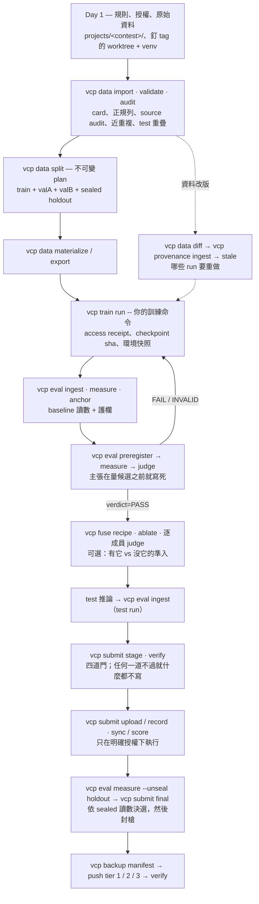

# vcp — vision contest pipeline

[](https://github.com/eric20041027/Vision-contest-pipeline/actions/workflows/ci.yml)
[](CHANGELOG.md)
[](CONTRIBUTING.md)
[](https://www.python.org/downloads/)
[](LICENSE)

**你繼續用 PyTorch、Ultralytics 或任何框架訓練。vcp 包住比賽的其餘部分——切分、讀數、主張、融合、提交、備份——讓你報出來的每一個數字都追得回產生它的那份資料、那段程式與那個權重，而你選出去的模型是真的會泛化的那一個。**

```text
$ uv run python examples/quickstart.py
VERDICT cmd=split status=OK plan=fixed-v1 train=120 valA=60 valB=60 seed=42
VERDICT cmd=eval.preregister status=OK dataset=demo prereg=p1 candidate=candidate baseline=baseline metric=accuracy subsets=valA,valB …
valA  baseline=0.6833333333333333 candidate=0.8833333333333333 delta=0.19999999999999996 t=2.98
valB  baseline=0.6833333333333333 candidate=0.9333333333333333 delta=0.25 t=4.01
VERDICT cmd=eval.judge status=OK dataset=demo prereg=p1 verdict=PASS bases_positive=2 provenance=declared
```

第二行的主張在量測候選**之前**就寫死；最後一行的判決才是準入——在兩個獨立的評估基底上，永遠不是 N 次取最好。

English: [README.md](README.md)

## 給誰用

- **單打的 Kaggle / AIdea 選手**：被 public 榜領先、private 榜垮掉燙過，想讓「這次真的有進步嗎？」由規則回答而不是感覺。
- **隊伍**：需要一本台帳記下什麼用什麼訓的、哪個融合成員憑證據留下、什麼時候上傳了什麼——隊友或 AI agent 冷接手也讀得懂。
- **課程或研究專案**：要交證據——不可變的切分計畫、預登記的主張、附帶數字的判決、證明結論可以重建的備份清單。

它**不是**：不訓練模型、不是實驗追蹤器（沒有儀表板、沒有 sweep）、從不碰你的平台憑證——Kaggle CLI、rclone 與訓練框架都還是你自己的。

## 60 秒 demo

需要 Python 3.12 與 [uv](https://docs.astral.sh/uv/)。

```bash
git clone https://github.com/eric20041027/Vision-contest-pipeline && cd Vision-contest-pipeline
uv sync
uv run python examples/quickstart.py
```

一條命令、約一分鐘、不下載任何東西：它在暫存目錄生成 240 張合成影像的資料集，走完整個迴圈——import、validate、split、兩個假模型、ingest、measure、anchor、**preregister**、measure、**judge**、report——每一步印出收尾的 `VERDICT`。最後幾行就是上面那段。

接著打開 `examples/quickstart.py`，把 `CANDIDATE_ACCURACY` 降到 `0.80` 左右再跑一次。候選在螢幕上仍然看起來比較好，但判決翻成 `FAIL`，因為兩個評估基底裡有一個沒過預登記的門檻。這就是這個工具的全部意義。

## 它怎麼運作

每一步都是一個以機器可讀判決收尾的命令，留下的檔案就是證據：

- **每個命令以 `VERDICT cmd=… status=OK|WARN|FAIL|ABORT k=v…` 收尾**（exit `0/0/1/2`；`--json` 時結果進 stdout、判決進 stderr）。命令永不互動提問。
- **寫一次的檔就不再改。** 切分計畫、預登記、融合配方、備份清單都不可變——要改就換 id，舊證據因此永遠還是它原本的意思。台帳（讀數、判決、提交）只增不改。
- **主張先於量測。** 候選只有在預登記的主張於至少兩個獨立評估基底上都贏才準入；sealed holdout 只在決選時以留痕的理由開一次。
- **讀取是證明出來的，不是宣告的。** 訓練迴圈經 vcp 的存取器讀資料時會留下收據，寫明它碰了哪些子集；「這個模型沒看過 holdout」因此可以查核。
- **比賽專屬程式碼不進核心。** `src/vcp` 不出現比賽名稱；你的指標、轉換器、融合器與輸出格式以 `--plugin projects.<contest>.<module>` 自行登記。



閘門不能倒置：`audit` 先於用它分組的 split；baseline 先有讀數再有候選；主張先於候選的第一次量測；`verdict=PASS` 先於候選 stage；stage / verify 先於任何上傳；真實上傳先於 sealed 決選；真實結論先於它的備份清單。

## 用在真實比賽

1. **釘住版本。** 在 release tag 開一個 detached worktree，比賽的 venv 以 editable 指向它——`main` 上的開發永遠動不到跑中的 run（`.claude/skills/vcp-release-and-environments` 有確切命令）。
2. **比賽程式放 `projects/<contest>/`**：`prepare.py`（主辦方格式 → `samples.jsonl`）、`train.py` / `predict.py`、`metrics.py`（官方計分器，以 `--plugin` 登記）、`RUNBOOK.md`（記下每個真實 id、命令與判決——失敗也留）。
3. **照上面那張圖走**，每個命令先讀判決再下一個。實際案例是 RSNA Knee：DICOM 多序列 study、12 標籤 macro AUC、notebook-only 推論——見 [`projects/rsna-knee/RUNBOOK.md`](projects/rsna-knee/RUNBOOK.md)。

### 讓 AI agent 幫忙

repo 內建十個 skill（Claude Code 讀 `.claude/skills/`，Codex 讀鏡射的 `.agents/skills/`），讓 agent 學到這些規則而不是猜。任何 session 先讀 `vcp-orientation`，再由生命週期入口依你所在的步驟轉到專用 skill：

| 時機 | Skill | 它擋掉 agent 的哪種錯 |
|---|---|---|
| 任何新 session，或「這是什麼？」 | `vcp-orientation` | 把 RUNBOOK 的一行當證據；把 `judge status=OK` 當準入；手改台帳 |
| 開始、接續或交接一場比賽 | `vcp-running-contests` | 閘門倒置；把待執行的命令說成已完成 |
| 新比賽第一天 | `vcp-contest-onboarding` | `--downloaded-at` 填錯；test 集留在框架外；從開發用 checkout 跑比賽 |
| 匯入、稽核、切分、匯出 | `vcp-data-pipeline` | 為了消 WARN 調參數；沒用 audit 分組就切分；用空標籤假裝 test 集 |
| 預測 → 讀數 → 主張 → 判決；融合 | `vcp-eval-and-fuse` | 事後預登記；在被汙染的基底上量；隨手開 holdout |
| 包訓練、stage / 上傳、備份 | `vcp-train-submit-backup` | 把 FAIL 的候選 stage 上去；沒授權就上傳；把本機副本當異機備份 |
| 主辦方換了資料 | `vcp-provenance` | 覆寫舊版；手改索引；在已知會選錯的情境用 `auto` |
| 想看整場比賽的 provenance 圖（檢查、交接、簡報） | `vcp-provenance-graph` | 為了「保險」先 rebuild 再 verify；畫到預設 root 而不是這場比賽的；把圖寫進 data root |
| 發版、建 venv、訓練跑的時候動框架 | `vcp-release-and-environments` | 為 `projects/` 的改動發版；把 `main` 拉進訓練正在用的 checkout |
| 新增格式、指標、融合器 | `vcp-extend-registry` | 比賽名進 `src/vcp`；登記了卻沒更新 CLI help 與參考文件 |

**在別的專案用**：同一組 skill 也是 Claude Code plugin `vcp`。先把這個 repo 加成 marketplace（只要一次）——本機 checkout（`claude plugin marketplace add C:/path/to/Vision-contest-pipeline`，原地載入，`git pull` 就更新 skill）或 GitHub（`claude plugin marketplace add eric20041027/Vision-contest-pipeline`）——再執行 `claude plugin install vcp@vision-contest-pipeline`。之後在任何專案用 `/vcp:<skill>` 呼叫，例如 `/vcp:vcp-provenance-graph`；桌面版也可以從輸入框旁的 **+ → Slash commands** 挑。

路由圖、委派整場比賽的 prompt、以及 skill 怎麼維護，在 [docs/guides/AGENT_SKILLS.md](docs/guides/AGENT_SKILLS.md)。

## 八層

每一層是一個命令群，可以只採用其中一層。

| 命令群 | 負責 | 主要命令 |
|---|---|---|
| `vcp data` | 資料卡、正規列、切分計畫、進場稽核、解碼快取、資料集差異 | `import`、`validate`、`split`、`audit`、`export`、`materialize`、`diff` |
| `vcp eval` | 讀數、護欄、σ_p、預登記、判決 | `ingest`、`measure`、`anchor`、`sigma`、`preregister`、`judge`、`status`、`report` |
| `vcp fuse` | 融合配方與成員準入 | `recipe`、`build`、`ablate` |
| `vcp train` | 包在任何訓練命令外面，記錄它實際讀了什麼、產出什麼 | `run`、`upload`、`status` |
| `vcp submit` | 配額、截止、候選身分、決選與封槍 | `init`、`stage`、`verify`、`upload`、`record`、`sync`、`final`、`status` |
| `vcp backup` | 從結論反向生成證據清單，分層推送與驗證 | `manifest`、`push`、`verify`、`pull`、`status` |
| `vcp artifact` | 上面各層共用的不可變產物原語 | `create`、`show`、`verify`、`lineage`、`status`、`clean` |
| `vcp provenance` | 資料集演進與下游影響索引（SQLite；PostgreSQL 可選） | `rebuild`、`sync`、`ingest`、`impact`、`stale`、`explain`、`graph`、`verify-index` |

完整選項表與範例流程：[docs/reference/cli.md](docs/reference/cli.md)。想先看圖：[視覺導覽](docs/guides/VCP_VISUAL_GUIDE.md)。

## 狀態與路線

`0.10.0`，尚未到 1.0：產物與台帳格式已經穩定到可以在上面蓋東西；CLI 契約在 minor 版本仍可能改變（每次 bump 的意義見 [CHANGELOG.md](CHANGELOG.md)）。

- **端到端驗證**：本機 RSNA 膝關節子集——資料、訓練、判決、stage、備份——目前正用於該比賽。
- **PostgreSQL provenance 後端**：五份 live 證據（整合測試 51/51；1,224 次量測的 calibration；1K–100K 的 3,672 次六方法基準；aggregate gate 以 1.018 / 1.017 通過的 held-out；真實資料軌），全程對 canonical replay 完全一致。兩個發現如實列為限制而不是藏起來：incremental 在量到的每個變更比例都贏 full rebuild，以及 v1 adaptive policy 在小圖與接近全量變更時會選錯 FULL。細節：[docs/benchmarks/postgres-provenance-report-v1.md](docs/benchmarks/postgres-provenance-report-v1.md)。
- **下一步**：稽核 Wave 1c（程式碼快照與授權收據）是 `1.0.0` 前最後一項；之後是 adaptive policy v2。

## 文件

| 位置 | 內容 |
|---|---|
| [docs/guides/VCP_VISUAL_GUIDE.md](docs/guides/VCP_VISUAL_GUIDE.md) | 六張圖：分層架構、完整生命週期、證據位置、怎麼讀 VERDICT、人與 agent 的分工 |
| [docs/guides/AGENT_SKILLS.md](docs/guides/AGENT_SKILLS.md) | 九個 agent skill、各自的觸發時機、怎麼委派一場比賽 |
| [docs/reference/cli.md](docs/reference/cli.md) | 每個命令、每個選項與範例流程 |
| [docs/guides/](docs/guides/) | 資料集演進 provenance、PostgreSQL 後端 |
| [docs/benchmarks/postgres-provenance-report-v1.md](docs/benchmarks/postgres-provenance-report-v1.md) | PostgreSQL 的十項證據總結 |
| [docs/superpowers/specs/](docs/superpowers/specs/) | 每層一份設計文件 |
| [docs/postmortems/](docs/postmortems/) | 這個專案的起點：海洋廢棄物比賽的賽後報告 |
| [CONTRIBUTING.md](CONTRIBUTING.md) | 開發環境、測試門檻與送出變更的方式 |

## 參與

歡迎開 issue 與 pull request——開發設定與審查門檻見 [CONTRIBUTING.md](CONTRIBUTING.md)。參與即表示同意[行為準則](CODE_OF_CONDUCT.md)。安全性回報：[SECURITY.md](SECURITY.md)。

## 授權

MIT，見 [LICENSE](LICENSE)。
