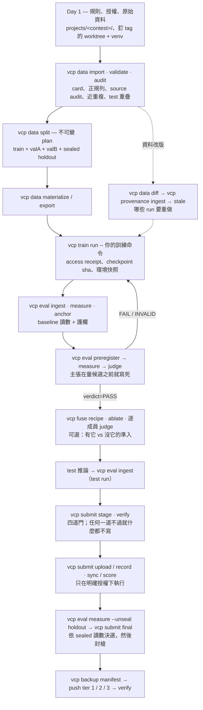
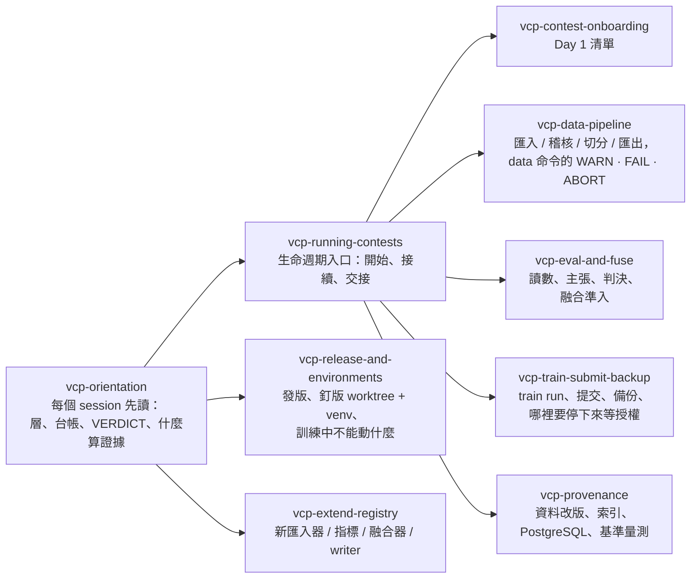

# vcp — vision contest pipeline

[](https://github.com/eric20041027/Vision-contest-pipeline/actions/workflows/ci.yml)
[](LICENSE)
[](https://www.python.org/downloads/)

**給影像競賽用的命令列流程框架：你報出來的每一個數字，都還追得回產生它的那份資料、那段程式與那個權重。**

多數比賽工具幫你訓練得更快。vcp 處理的是另一種失敗：某個模型在你螢幕上看起來比較好、被選進決選，然後在 private 榜上垮掉。做法是把證據鏈變成機械而不是記憶——切分計畫寫下就不能偷改、主張必須在量測候選之前寫死、護欄一移動讀數就拒絕產生、備份清單從你要辯護的結論反向生成。

English: [README.md](README.md)

## 它針對的那種失敗

起點是一份海廢偵測比賽的賽後報告：public 榜領先的提交在 private 榜崩掉。三個根因，現在各自變成一個機制而不是習慣：

| 當初出的問題 | vcp 的處置 |
|---|---|
| 只在一份資料切片上驗證過 | 切分計畫至少要兩個互斥的 eval 子集加一個 sealed holdout；判決要求候選在其中至少兩個上勝出 |
| 融合成員靠感覺準入，不是靠證據 | 準入是「有它 vs 沒它」：每位成員一份預登記主張、一份自己的判決 |
| σ_p 事後才估、估到順眼為止 | σ_p 是預登記的輸入；tuning 類主張沒有它就直接拒絕 |

## 安裝

需要 Python 3.12 與 [uv](https://docs.astral.sh/uv/)。

```bash
git clone https://github.com/eric20041027/Vision-contest-pipeline
cd Vision-contest-pipeline
uv sync                       # 核心
uv sync --extra dicom         # DICOM 匯入器與解碼器
uv sync --extra postgres      # 可選的 PostgreSQL provenance 後端
uv run vcp --help
```

或直接從 git 安裝 CLI：

```bash
pip install git+https://github.com/eric20041027/Vision-contest-pipeline
```

## 快速上手

一個命令、約一分鐘、不用下載任何資料。它在暫存目錄建一個 240 張圖的合成資料集，然後把從原始檔到一次判決的整條流程走完：

```bash
uv run python examples/quickstart.py
```

十二個步驟，每一步都印出該命令收尾的 `VERDICT`：

1. 造一個很小的 image-folder 資料集
2. **import** — 原始檔變成 dataset card、正規的 `samples.jsonl`，外加一份逐列來源稽核
3. **validate** — 重驗卡、列與雜湊
4. **split** — 一份不可修改的切分計畫，含兩個互相獨立的 eval 子集
5. 產生兩個假模型的預測，一個約 70% 正確、一個約 93%
6. **ingest** — 框架輸出變成正規預測檔（記 sha、登記進 run）
7. **measure** 基準 — 先過護欄，再每個子集 × 指標一列讀數
8. **anchor** — 把這列讀數凍成護欄，之後每次量測都要對得上
9. **preregister** — 主張在候選被量之**前**就寫死
10. **measure** 候選
11. **judge** — 每個基底做配對 bootstrap；準入要求至少兩個基底 t ≥ 2.0
12. **report** — 台帳

最後的判決長這樣：

```text
valA  baseline=0.683 candidate=0.883 delta=0.200 t=2.98
valB  baseline=0.683 candidate=0.933 delta=0.250 t=4.01
VERDICT cmd=eval.judge status=OK dataset=demo prereg=p1 verdict=PASS bases_positive=2
```

接著打開 `examples/quickstart.py`，把 `CANDIDATE_ACCURACY` 降到 `0.80` 左右再跑一次。差距看起來還是很漂亮，但判決會翻成 `FAIL`，因為兩個基底有一個沒過門檻。這就是這個工具存在的理由。

## 八層加治理

每一層是一個命令群，可以只採用其中一層。

| 命令群 | 負責 | 主要命令 |
|---|---|---|
| `vcp data` | 資料卡、正規列、切分計畫、進場稽核、解碼快取 | `import`、`validate`、`split`、`audit`、`export`、`materialize`、`diff` |
| `vcp eval` | 讀數、護欄、σ_p、預登記、判決 | `ingest`、`measure`、`anchor`、`sigma`、`preregister`、`judge`、`status`、`report` |
| `vcp fuse` | 融合配方與成員準入 | `recipe`、`build`、`ablate` |
| `vcp train` | 包在任何訓練命令外面，記錄它實際讀了什麼、產出什麼 | `run`、`upload`、`status` |
| `vcp submit` | 配額、截止、候選身分、決選與封槍 | `init`、`stage`、`upload`、`record`、`sync`、`final`、`verify`、`status` |
| `vcp backup` | 從結論反向生成證據清單，分層推送與驗證 | `manifest`、`push`、`verify`、`pull`、`status` |
| `vcp artifact` | 上面各層共用的不可變產物原語 | `create`、`show`、`verify`、`lineage`、`status`、`clean` |
| `vcp provenance` | 資料集演進與下游影響索引 | `rebuild`、`sync`、`ingest`、`impact`、`stale`、`explain`、`verify-index` |

完整選項表與範例流程：[docs/reference/cli.md](docs/reference/cli.md)。想先看圖：[視覺導覽](docs/guides/VCP_VISUAL_GUIDE.md)。

## 用 vcp 跑一場比賽

整場比賽是一條有閘門的鏈：每個箭頭是一個命令，先讀它的 `VERDICT` 再往下走；虛線分支是主辦方換了一版資料時的處理。



不能倒置的閘門：`audit` 先於用它分組的 split；baseline 先 `measure` / `anchor` 再有候選；`preregister` 先於候選的第一次 `measure`；`verdict=PASS` 先於 `stage --kind candidate`；`stage` / `verify` 先於任何上傳；至少一筆真實上傳後才進 sealed 決選窗口；真實結論存在後才建它的備份清單。sealed holdout 只以 `--unseal --reason` 開一次，理由留在台帳。

## 讓 agent 幫忙：skill 的用法與時機

repo 內建九個 skill（Claude Code 讀 `.claude/skills/`，Codex 讀鏡射的 `.agents/skills/`）。它們讓 agent 學到上面的規則而不是猜。任何 session 先讀 `vcp-orientation`，再由生命週期入口依你所在的步驟轉到專用 skill。



| 時機 | Skill | 它擋掉的錯 |
|---|---|---|
| 任何新 session，或有人問「這是什麼」 | `vcp-orientation` | 把 RUNBOOK 的一行當證據；把 `judge status=OK` 當準入；手改台帳 |
| 開始、接續或交接一場比賽 | `vcp-running-contests` | 閘門倒置；把待執行的命令說成已完成 |
| 新比賽第一天 | `vcp-contest-onboarding` | `--downloaded-at` 填錯；test 集留在框架外；從開發用 checkout 跑比賽 |
| 匯入、稽核、切分、匯出 | `vcp-data-pipeline` | 為了消 WARN 調參數；沒用 audit 分組就切分；用空標籤假裝 test 集 |
| 預測 → 讀數 → 主張 → 判決；融合 | `vcp-eval-and-fuse` | 事後預登記（含量過的權重換 run id 重 ingest）；在被汙染的基底上量；隨手開 holdout |
| 包訓練、stage / 上傳、備份 | `vcp-train-submit-backup` | 把 FAIL 的候選 stage 上去；沒授權就上傳；把本機副本當異機備份 |
| 主辦方換了資料 | `vcp-provenance` | 覆寫舊版；手改索引；在已知會選錯的情境用 `auto` |
| 發版、建 venv、訓練跑的時候動框架 | `vcp-release-and-environments` | 為 `projects/` 的改動發版；把 `main` 拉進訓練正在用的 checkout |
| 新增格式、指標、融合器 | `vcp-extend-registry` | 比賽名進 `src/vcp`；登記了卻沒更新 CLI help 與參考文件 |

人自己操作也是同一個順序：[視覺導覽](docs/guides/VCP_VISUAL_GUIDE.md) 是 orientation，[docs/reference/cli.md](docs/reference/cli.md) 是專用手冊，比賽的 `projects/<contest>/RUNBOOK.md` 是真正做過什麼的台帳。要把整場比賽委派給 agent，用 `.claude/skills/vcp-running-contests/operator-guide.md` 裡的委派模板。

## 開始之前值得知道的設計規則

- **每個命令以 `VERDICT` 收尾。** `status=OK|WARN|FAIL|ABORT`，exit code `0/0/1/2`，欄位是機器可讀的 `key=value`。`--json` 時結果進 stdout、VERDICT 進 stderr。命令永不互動提問。
- **寫一次的檔就不再改。** 切分計畫、預登記、融合配方、備份清單都不可修改；要改就換 id——舊證據因此永遠還是它原本的意思。
- **台帳只增不改。** 讀數、判決、σ_p 與提交紀錄都是 append-only；run 卡會換寫，但舊的 sha 先進 `history.jsonl`。
- **護欄先於讀數。** 錨定過的讀數若重現不出來，`measure` 直接中止、一列都不寫，而不是在條件已變的情況下記下一個數字。
- **讀取是證明出來的，不是宣告的。** 訓練迴圈經 vcp 的存取器讀資料時會留下收據，寫明它到底碰了哪些子集；「這個模型沒看過 holdout」因此可以查核，而不只是口頭保證。
- **vcp 從不碰你的憑證。** 沒有 token 選項、沒有憑證欄位、不讀 rclone 或 Kaggle 設定檔；第三方 CLI 的輸出落地前先去敏。
- **比賽專屬程式碼不進核心。** `src/vcp` 不出現比賽名稱；你的指標、轉換器與輸出格式以 `--plugin` 自行登記。

## 文件

| 位置 | 內容 |
|---|---|
| [docs/guides/VCP_VISUAL_GUIDE.md](docs/guides/VCP_VISUAL_GUIDE.md) | 六張圖：分層架構、完整生命週期、證據位置、怎麼讀 VERDICT、人與 agent 的分工 |
| [.claude/skills/](.claude/skills/) | 上面那九個 agent skill（`.agents/skills/` 是給 Codex 的鏡射）；`vcp-orientation` 也是給人看的最短規則摘要 |
| [docs/benchmarks/postgres-provenance-report-v1.md](docs/benchmarks/postgres-provenance-report-v1.md) | PostgreSQL adaptive provenance 的十項證據總結（版本、整合測試、六方法、held-out gate、真實資料、延遲、儲存、EXPLAIN、一致性） |
| [docs/reference/cli.md](docs/reference/cli.md) | 每個命令、每個選項與範例流程 |
| [docs/guides/](docs/guides/) | 資料集演進 provenance、PostgreSQL 後端 |
| [docs/superpowers/specs/](docs/superpowers/specs/) | 每層一份設計文件 |
| [docs/postmortems/](docs/postmortems/) | 這個專案的起點：那場比賽的賽後報告 |
| [CONTRIBUTING.md](CONTRIBUTING.md) | 開發環境、測試門檻與送出變更的方式 |

## 專案狀態

`0.8.1`，尚未到 1.0：產物與台帳格式已經穩定到可以在上面蓋東西，但 CLI 契約在 minor 版本仍可能改變。每次 bump 的意義見 [CHANGELOG.md](CHANGELOG.md)。

誠實的邊界：整條流程已在本機的 RSNA 膝關節子集上端到端跑過（資料、訓練、判決、stage、備份），目前正用於該比賽。可選的 PostgreSQL provenance 後端有五份 live 證據——整合測試 51/51、1,224 次量測的 calibration、1K–100K 的 3,672 次六方法基準、aggregate gate 通過（1.018 / 1.017）的 held-out、真實資料軌——全程對 canonical replay 完全一致。兩個發現如實列為限制而不是藏起來：incremental 在量到的每個變更比例都贏 full rebuild（沒有交會點），以及 v1 adaptive policy 在小圖與接近全量變更時會選錯 FULL；1M 規模依裁決不在正式矩陣。見 [docs/benchmarks/postgres-provenance-report-v1.md](docs/benchmarks/postgres-provenance-report-v1.md)。

## 參與

歡迎開 issue 與 pull request——開發設定與審查門檻見 [CONTRIBUTING.md](CONTRIBUTING.md)。參與即表示同意[行為準則](CODE_OF_CONDUCT.md)。安全性回報：[SECURITY.md](SECURITY.md)。

## 授權

MIT，見 [LICENSE](LICENSE)。
