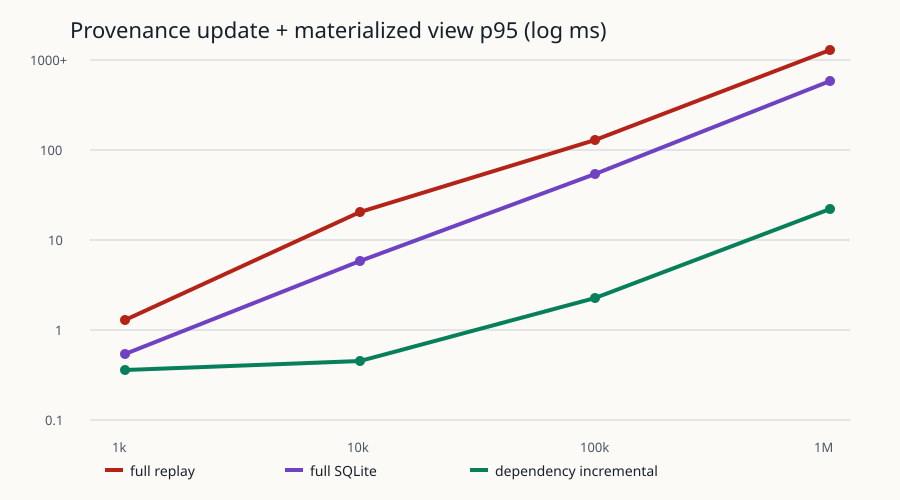

# Dataset Evolution Provenance Benchmark — 2026-09-13

## 結論

Real metadata-copy track 的 full graph、incremental graph、每個 head status 與 `verify-index` 均精確
相等。Production-schema/API track 直接呼叫 `ProvenanceIndex.ingest_diff()`，四級 parity 均為 100%；
100k 的 update+query p95 相對 production full graph load+fingerprint 為 10.34×，1M 為 9.78×，
通過兩級 ≥5× target。小資料固定成本明顯：1k 只有 0.39×、10k 2.88×，本機 crossover 在
10k 與 100k 之間。另保留的 algorithm microbenchmark 不是 production 效能證據。



## Real track（來源唯讀）

runner 只讀 live RSNA roots，將四份 `dataset.yaml`/split/samples、相關 run/prediction 與 measure
ledger 複製到 OS temporary directory；diff artifact 與 SQLite 只建立在副本，結束即刪除。

| Transition | ADDED | REMOVED | MODIFIED | Dominant domain/effect |
|---|---:|---:|---:|---|
| r3 → r4 | 0 | 4 | 4,403 | GROUP / SPLIT_AFFECTING |
| r4 → r5 | 0 | 0 | 4,345 | META / UNKNOWN |
| r5 → r6 | 0 | 0 | 0 | exact no-op |

副本連到 7 個 r3/r4 runs；補齊 changed sample-version/`CONTAINS_CHANGE` 後，normalized graph 為
13,196 entities、17,569 edges、8,752 changes、0 gaps。
首次 real incremental run 曾發現 multi-hop 新 head 沒重算較早 ancestor runs；修正 dirty closure 後重跑，
`graph_parity=true`、`status_parity=true`、`verify_index.ok=true`。結果的 `fallback` grade 是因 temporary
copy 刻意不複製 live source-audit artifacts；每份 `samples.jsonl` 仍完整 hash/schema 驗證。

## Production schema/API scaled track

每級先以 production SQLite schema 建 deterministic 歷史，再發布一份有 100 個 events、重新驗證
endpoint inputs 的正式 `dataset_diff` artifact。每次 timed update 都直接呼叫
`ProvenanceIndex.ingest_diff()`；full baseline 呼叫 production `_load_graph()` 與 production graph
fingerprint。fixture 複製與 generation 不計入 update latency。

| Historical events | Repetitions | Full load+fingerprint p95 ms | Production ingest p95 ms | Status query p95 ms | Incremental+query p95 ms | Speedup | Parity |
|---:|---:|---:|---:|---:|---:|---:|---:|
| 1,000 | 7 | 21.384 | 52.602 | 2.830 | 55.218 | 0.39× | 100% |
| 10,000 | 7 | 176.223 | 58.301 | 2.974 | 61.275 | 2.88× | 100% |
| 100,000 | 3 | 2,114.040 | 200.143 | 4.378 | 204.521 | 10.34× | 100% |
| 1,000,000 | 3 | 23,731.252 | 2,404.970 | 30.242 | 2,427.051 | 9.78× | 100% |

1M production index fixture 為 1,403,138,048 bytes；相對 726,450,420 bytes canonical metadata
為 1.931×（四級為 1.929–2.113×）。fixture 隨 scale 建立 15–3,404 個 runs，以及
reading、artifact、fusion、submission 依賴；1M update 後有 7,423 個 STALE、205 個 VALID entities，
因此量測包含實際 affected-subgraph 傳播。production ingest 載入 entities/edges/transition
topology，但不讀既有 `sample_changes.event_json`、不展開既有 transition change-id arrays，也不重算
全圖 hash；它以 source-head materialization 加本次 delta 更新 dirty closure，fingerprint 以新 records
增量前進。測試另有 spy regression，若 ingest 回頭呼叫 full graph hash 或 history load 會失敗。

## Algorithm microbenchmark（非 production claim）

| Events | Repetitions | Full replay p95 ms | Full SQLite p95 ms | Incremental p95 ms | Speedup | Rebuild ms | Index/canonical |
|---:|---:|---:|---:|---:|---:|---:|---:|
| 1,000 | 7 | 1.294 | 0.534 | 0.357 | 3.63× | 10.1 | 1.96× |
| 10,000 | 7 | 20.574 | 5.789 | 0.452 | 45.53× | 84.6 | 1.86× |
| 100,000 | 3 | 129.964 | 54.284 | 2.275 | 57.12× | 1,280.7 | 1.87× |
| 1,000,000 | 3 | 1,304.653 | 595.949 | 22.035 | 59.21× | 17,804.4 | 1.87× |

這一表是原先的 schema-preserving algorithm kernel，用來比較演算法與查詢形狀；它沒有執行 artifact
verification、checkpoint、production transaction 或 `ProvenanceIndex.ingest_diff()`，因此不能用來宣稱
正式實作速度。Generator seed `20260913`；opaque sample/hash IDs，production `SampleChange` fields，8 subsets，run
比例取 real snapshot 約 15/4,407，並建 valid reading/artifact/fusion/submission edges。每 chunk 的頭尾事件
以 production pydantic schema 驗證。U1 small、U2 large、U3 no-op、U4 run dependencies、U5
supersession 與 U6 rollback 均有 machine timing；Q1–Q7 各自有 p50/p95。

環境：Windows 11 build 26200、Python 3.12.14、SQLite 3.53.1、AMD64 Family 26 Model 68；
測量時 base commit `09af0cc04f35248b8000bf3232285ebe61780980` 加未提交 implementation changes。
SQLite native allocation 不在 Python `tracemalloc` 範圍，因此 peak memory 明列未量測，沒有填假數字。

## 可重跑命令與證據

```powershell
uv run python tests/performance/provenance/real_validation.py `
  --data-root C:\path\to\vcp-data --configs-root C:\path\to\configs `
  --output docs/benchmarks/provenance-real-2026-09-13.json

uv run python tests/performance/provenance/benchmark.py `
  --output docs/benchmarks/provenance-scaled-2026-09-13.json

uv run python tests/performance/provenance/production_benchmark.py `
  --output docs/benchmarks/provenance-production-2026-09-13.json
```

原始機器可讀結果：`provenance-real-2026-09-13.json`、
`provenance-scaled-2026-09-13.json`、`provenance-production-2026-09-13.json`。Synthetic 數字只代表
此 runner 與本機，不描述 live RSNA operational history。
