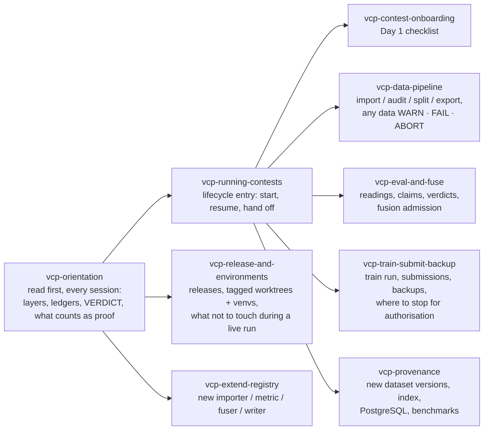

# Working with an agent: the vcp skills and when they fire

The repository ships nine skills — `.claude/skills/` for Claude Code, mirrored byte-for-byte to `.agents/skills/` for Codex. They are how an agent learns the contest rules instead of guessing them. Load `vcp-orientation` first in any session; the lifecycle entry then routes to a specialist skill for the step you are on.

## When each skill applies

| When | Skill | What it stops you from doing wrong |
|---|---|---|
| Any new session, or someone asks "what is this?" | `vcp-orientation` | Treating a RUNBOOK line as evidence; reading `judge status=OK` as admission; editing a ledger |
| Starting, resuming or handing off a contest | `vcp-running-contests` | Reordering the gates; reporting a pending command as done |
| First day of a new contest | `vcp-contest-onboarding` | Wrong `--downloaded-at`; test set left outside the framework; running from the development checkout |
| Importing, auditing, splitting, exporting | `vcp-data-pipeline` | Tuning options to silence a WARN; splitting without audit groups; faking labels for a test set |
| Predictions → readings → claims → verdicts; ensembles | `vcp-eval-and-fuse` | Post-hoc pre-registration (including re-ingesting measured weights under a new run id); measuring on a contaminated base; opening the holdout casually |
| Wrapping training, staging and uploading, backing up | `vcp-train-submit-backup` | Staging a FAILed candidate; uploading without authorisation; mistaking a local copy for an off-machine backup |
| The organiser changes the data | `vcp-provenance` | Overwriting the old version; hand-editing the index; using `auto` where the policy is known to pick wrong |
| Releasing, setting up venvs, working while a run is live | `vcp-release-and-environments` | Bumping the version for a `projects/` change; pulling `main` into a checkout a training run is using |
| Adding a format, metric or fuser | `vcp-extend-registry` | Putting a contest name into `src/vcp`; registering without updating the CLI help and reference |

## How to delegate a whole contest

Give the agent the rules URL, raw-data location, task and metric, grouping unit (patient / study / source), compute and time budget, data and config roots, backup destination, exactly which external uploads are already authorised, and whether the sealed holdout may be opened. The ready-to-paste prompt is in [`.claude/skills/vcp-running-contests/operator-guide.md`](../../.claude/skills/vcp-running-contests/operator-guide.md); the agent will read `vcp-orientation`, verify the ledgers, report the current stage, and stop only at real decision points (external submission, unsealing, unauthorised destinations, budget).

## For a person

The same order applies without an agent: the [visual guide](VCP_VISUAL_GUIDE.md) is the orientation, [`docs/reference/cli.md`](../reference/cli.md) is the specialist, and the contest's `projects/<contest>/RUNBOOK.md` is the ledger of what was actually done. Each skill file is short and readable on its own; `vcp-orientation/SKILL.md` is the fastest summary of the rules for a human too.

## Keeping the skills honest

Skills describe contracts that live in code. When a command, VERDICT field or ruling changes, update the matching skill in the same PR, keep `SKILL.md` under ~450 words with details in its reference file, and copy the directory to `.agents/skills/`. The set was last verified on 2026-09-21 by giving each new skill a realistic scenario to a fresh agent that had read nothing else.
