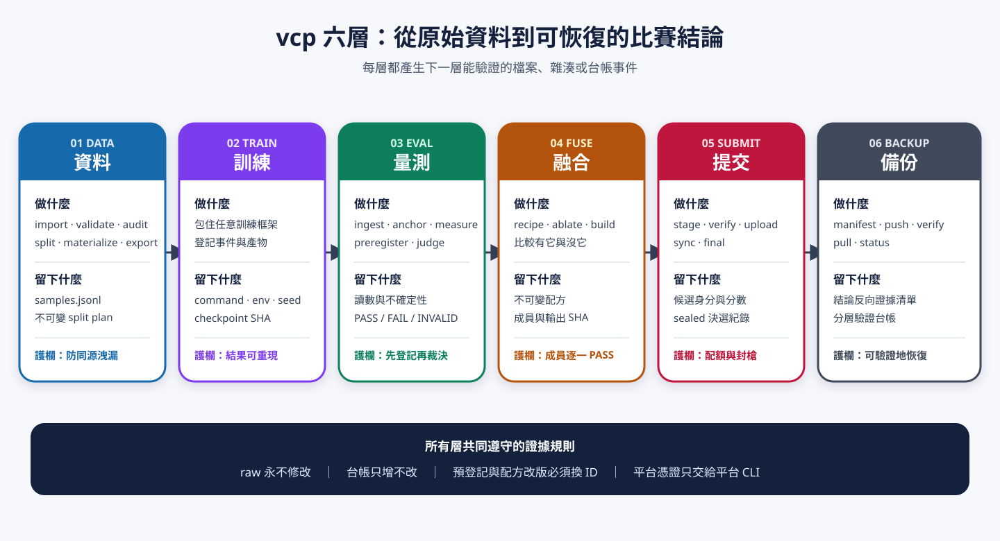
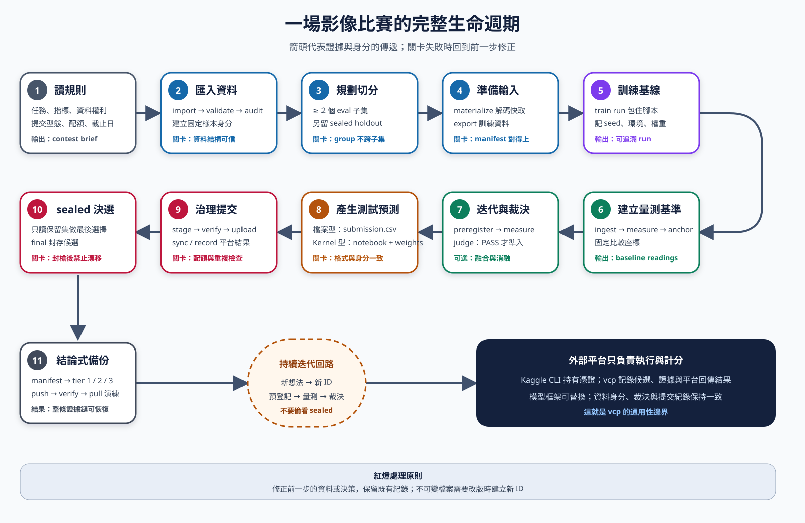
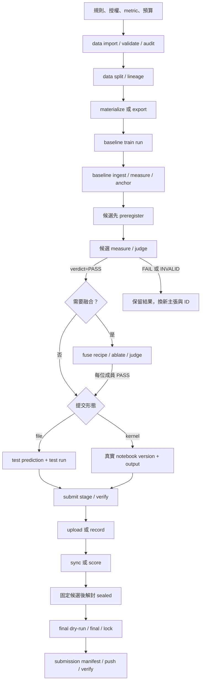
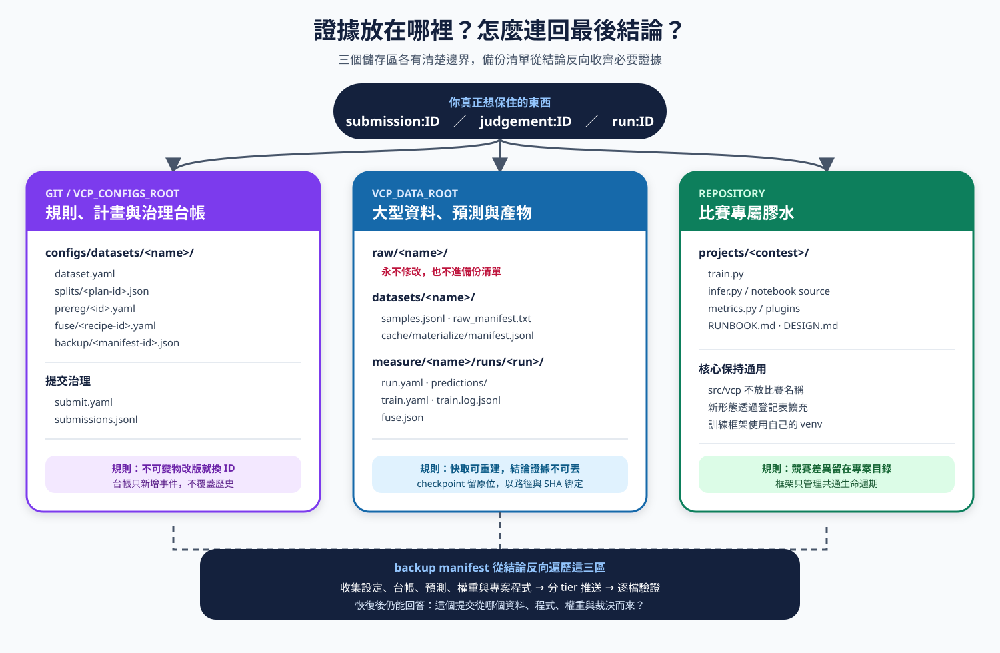
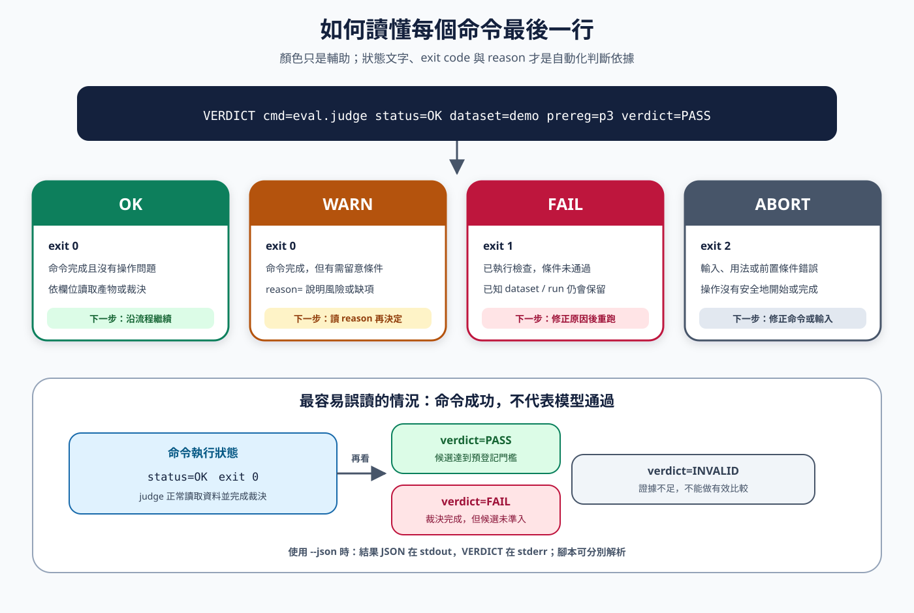
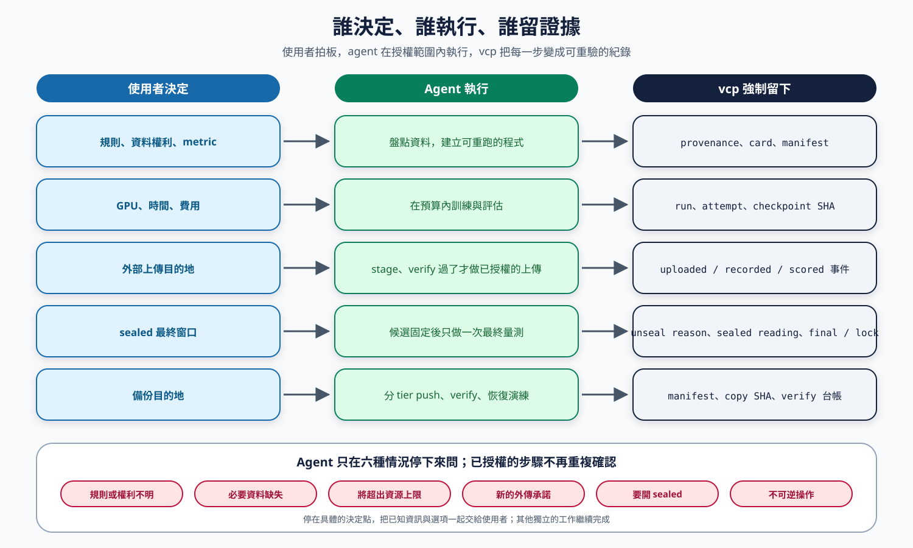
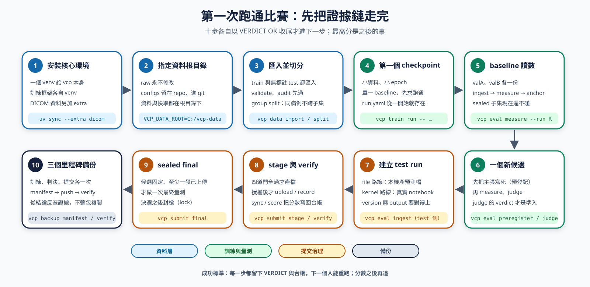

# vcp 視覺導覽：一場影像比賽如何運行

這份文件給第一次接觸 vcp 的使用者。它先用圖說明整體，再帶你看資料、訓練、量測、融合、提交與備份之間的關係。完整選項仍以根目錄 [README](../../README.md) 與 `uv run vcp <group> <command> --help` 為準。

> 圖中的「六層」是 0.3.0 的骨架；0.4.0 起多了不可變產物層（`vcp artifact`），0.7.0 / 0.8.0 起多了 dataset provenance（`vcp data diff`、`vcp provenance`）。這些新層不改變下面的流程，細節見 [HANDOVER §3](../handover/HANDOVER.md)。

## 先記住一件事

vcp 不是模型框架。PyTorch、Ultralytics、推論 notebook 和比賽格式由 `projects/<contest>/` 提供；vcp 負責固定資料與模型身分、阻止驗證洩漏、保存判決、治理提交，並建立可恢復的證據鏈。



六層共同回答四個問題：

1. **來源**：這個結果用哪份資料、切分與程式產生？
2. **證據**：它在固定驗證條件下真的比較好嗎？
3. **身分**：提交用的權重是否就是通過判決的權重？
4. **恢復**：換機器後能否找回必要檔案並重產提交？

## 完整生命週期



下圖是同一條流程的 Mermaid 版本，可在 GitHub 直接縮放並檢查分支：



有六個先後不能交換：

| 必須先做 | 才能做 | 原因 |
|---|---|---|
| audit | 使用 audit group 的 split | 近重複必須先被綁成同一切分單位 |
| baseline measure + anchor | 候選量測 | 後續每次量測都要重驗固定護欄 |
| preregister | 候選 measure | 不能看到分數後才改主張與門檻 |
| ablate --preregister | 融合完整配方 measure | 每位成員要用「有它 vs 沒它」證明增益 |
| stage + verify | 平台提交 | 先確認身分、格式、SHA 與可重現性 |
| uploaded/recorded + 候選固定 | sealed final | holdout 只服務最後決選，不能拿來調參 |

## 八層分別做什麼

| 層 | 主要命令 | 輸入 | 主要產物 | 進入下一層的條件 |
|---|---|---|---|---|
| 資料 | `data import/validate/audit/split/lineage/export/materialize` | 主辦方資料與標註 | dataset card、samples、固定 plan、cache/export manifest | 資料自洽、群組不洩漏、異常已有裁決 |
| 訓練 | `train run/upload/status` | 訓練程式、config、venv、seed | run card、train snapshot/log、checkpoint SHA | 訓練 attempt 可追蹤，final checkpoint 已登記 |
| 量測 | `eval ingest/measure/anchor/sigma/preregister/judge` | 預測、metric、主張 | readings、anchors、prereg、judgements | candidate 的 `verdict=PASS` |
| 融合 | `fuse recipe/ablate/build` | 多個已量測 run | 不可變 recipe、消融 run、`fuse.json` | 每位融合成員均有 PASS 準入 |
| 提交 | `submit init/stage/verify/upload/record/sync/score/final` | eval/test 身分或 kernel version | submission、stage card、只增台帳、final/lock | 平台事實已回讀，最終選擇有 sealed 讀數 |
| 備份 | `backup manifest/push/verify/pull/status` | run、judgement 或 submission 結論 | 不可變 manifest、逐檔 SHA、副本台帳 | 所需 tier 在真正目的地驗證成功 |
| 產物 | `artifact create/show/verify/lineage/status/relink/clean` | 任何要寫一次不改的檔案（收據、source audit、dataset diff、policy、自訂 kind） | `artifacts/<kind>/<id>/manifest.json`（有它才是產物）、supersession 台帳 | `verify` 無 mismatch / missing |
| provenance | `data diff`、`provenance rebuild/sync/ingest/impact/stale/explain/status/verify-index` | 兩個資料集版本、既有 run | `dataset_diff` artifact、可刪除的衍生索引（SQLite 預設、PostgreSQL optional） | `stale --head` 的 VALID/STALE/REVIEW/BROKEN 已讀過，重跑清單由它決定 |

融合是可選步驟；baseline 也能以 `--kind baseline --reason ...` 明確記錄準入豁免。正式 `candidate` 仍然必須有 PASS judgement；`probe` 只供探索，永不進 final。

## 檔案放在哪裡



```text
repo/
├─ configs/datasets/<name>/       # 進 Git：card、split、prereg、recipe、submit、manifest
├─ projects/<contest>/            # 進 Git：模型、轉換器、metric、writer、notebook、RUNBOOK
└─ src/vcp/                       # 只放通用框架，不出現比賽名稱

VCP_DATA_ROOT/
├─ raw/<name>/                    # 永不修改，不進 Git
├─ datasets/<name>/               # samples、raw manifest、materialize cache
├─ runs/<run>/                    # run.yaml、predictions、train/fuse 證據
├─ measure/<name>/                # readings、judgements、sigma、anchors
└─ submit/<test>/<id>/            # submission 與 stage.json
```

更新規則並不相同：

- `raw/` 永不修改。
- readings、judgements、sigma、history、train log、submission ledger、backup log 只能追加。
- plan、prereg、fuse recipe、backup manifest 寫後不改；要改就換 ID。
- run card、prediction、train snapshot、fuse record 可以透過指定操作換寫，但必須留下 history 或 log。
- cache 可以重建；它不是決策證據，也不進 backup manifest。

## 如何讀 VERDICT



每個 vcp CLI 命令都以一行 VERDICT 收尾：

```text
VERDICT cmd=<命令> status=OK|WARN|FAIL|ABORT key=value ...
```

| 狀態 | Exit code | 意思 | 操作 |
|---|---:|---|---|
| `OK` | 0 | 命令完成 | 核對產物與領域結果 |
| `WARN` | 0 | 完成，但有需要裁決的風險 | 讀完欄位並把決定寫進 RUNBOOK |
| `FAIL` | 1 | 輸入、資料或準入條件不合格 | 修正問題或保留不合格結果 |
| `ABORT` | 2 | 環境、計畫或程式使操作不能開始/繼續 | 修環境或程式，不得假裝完成 |

最容易誤解的是：

```text
VERDICT cmd=eval.judge status=OK ... verdict=FAIL
```

這表示「判決程序成功完成，而且候選不準入」。CI 要在候選未通過時失敗，使用 `eval judge --strict`。`--json` 模式下，JSON 在 stdout，VERDICT 在 stderr。

## 人、agent 與 vcp 如何分工



| 使用者決定 | Agent 執行 | vcp 強制留下 |
|---|---|---|
| 規則、資料權利、metric | 盤點與建立可重跑程式 | provenance、card、manifest |
| GPU、時間、費用 | 在預算內訓練與評估 | run、attempt、checkpoint SHA |
| 外部上傳目的地 | 完成 stage/verify 後執行已授權上傳 | uploaded/recorded/scored 事件 |
| sealed 最終窗口 | 固定候選後執行一次最終量測 | unseal reason、sealed reading、final/lock |
| 備份目的地 | 分 tier push、verify、恢復演練 | manifest、copy SHA、verify 台帳 |

Agent 不必為已授權的步驟反覆詢問。只有規則或權利不明、必要資料缺失、將超出資源上限、要進行新的外傳承諾、要開 sealed 或要做不可逆操作時，才停在具體決定點。其他獨立工作繼續完成。

## 第一次跑通比賽



第一次的成功標準是「完整證據鏈跑通」，不是最高分：

1. `uv sync`；DICOM 另用 `uv sync --extra dicom`。
2. 設好 `VCP_DATA_ROOT`；正常情況讓 configs 留在 repo。
3. 把 train 與無標註 test 都匯入，完成 validate、audit 與 group split。
4. 用小資料、小 epoch、單一 baseline 建立第一個 checkpoint。
5. baseline 在 valA/valB 完成 ingest、measure、anchor。
6. 建立一個新的 prereg candidate，完成 measure、judge。
7. file 路線建立 test run；kernel 路線取得真實 notebook version/output。
8. 完成 stage、verify；得到授權後 upload/record、sync/score。
9. 候選固定且至少一發已上傳後，才進 sealed final。
10. 在訓練、重要判決與提交三個里程碑建立並驗證備份。

## 備份不等於複製整個資料夾

vcp 從「結論」反查需要的證據：

- `run:<id>`：保全一次訓練或推論。
- `judgement:<prereg>`：保全一次候選判決。
- `submission:<id>`：保全一次實際提交所需的整條證據鏈。
- `all`：保全目前可追蹤的全部證據。

Tier 1 是決策與小型證據，Tier 2 是重現資料與預測，Tier 3 是大型權重。`raw/`、`cache/` 不進 manifest，因此還要保存原始資料重新取得方式、Git commit/source bundle、環境鎖定檔與必要 notebook bundle。同一顆硬碟上的副本不等於異機備份。

## 接著讀什麼

- [README](../../README.md)：比賽流程圖、skill 用法與時機、每層的命令表；完整選項在 [docs/reference/cli.md](../reference/cli.md)。
- [vcp-orientation skill](../../.claude/skills/vcp-orientation/SKILL.md)：三分鐘理解 vcp 與 skill 路由；[vcp-running-contests skill](../../.claude/skills/vcp-running-contests/SKILL.md)：Agent 操作完整比賽的入口。
- [交接文件](../handover/HANDOVER.md)：程式碼地圖、現況、陷阱與開放待辦。
- [RSNA Knee RUNBOOK](../../projects/rsna-knee/RUNBOOK.md)：DICOM 多序列比賽的實際案例與真實讀數。

遇到文件與實際狀態不一致時，以卡、台帳、SHA、平台回讀與本次 VERDICT 為準；RUNBOOK 裡尚未執行的命令不是完成證據。
